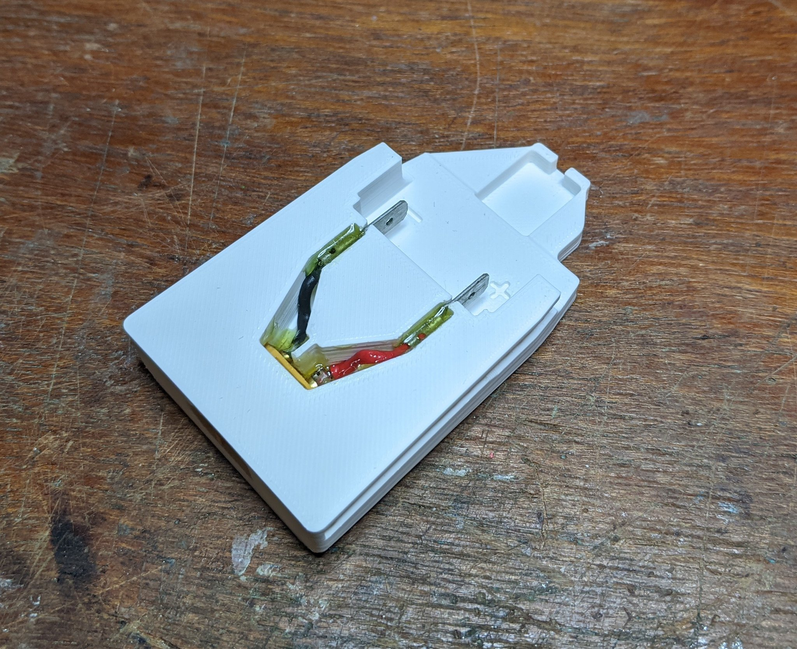

Bosch Power-4-All battery pack adapter
======================================

This is a simple adapter to attach on to Bosch Power4All batteries. It was
measured against an 18 V, 1.5 Ah (5 cell) battery pack from the PSB 1800 LI-2
cordless drill, but I assume it would fit all 18 V "Power 4 All" batteries.

It is designed to connect spade terminals into the battery's terminals, and
output to an XT60 connector for whatever other use you have in mind.

There are [similar commercial products](https://www.amazon.co.uk/Durable-Battery-Converter-Adapter-Accessories-black/dp/B0865VZSXR)
available, though I'm not sure if there are ones that fit Power4All.

Battery Notes
-------------

In my 1.5 Ah battery, there are 5, series, Samsung INR18650-15Q cells. There
is **no protection circuitry**. There is no over-discharge or over-charge
protection built in to the battery pack, so care must be taken not to over
discharge or over-charge the battery.

The terminal next to positive, is connected to an NTC thermistor. The terminal
next to negative is wired to a resistor.

Main contacts:

```
(-)  R   T   (+)
 |   |   |    |
 |-R-`   |    |
 |       |    |
 |--NTC--`    |
 |            |
 `-Cells (5S)-`
```

The charging terminals on the bottom of the pack are in the same order. They
have a different resistor value, and there's a diode in series with the
positive side of the cells so that the battery cannot be discharged from these
contacts.

I would recommend putting a cover on the XT60 connector when not in use, so
that it can't get accidentally shorted in a bag. "cap.stl" should be good to
go, it fits reasonably well for me when printed with standard settings at 0.2
mm layer height

For use with a TS100 soldering iron, I use the [IronOS](https://github.com/Ralim/IronOS)
firmware which allows for setting a lower voltage limit, to avoid
over-discharging the cells.

Printing
--------

The STL file for the main part is oriented for printing - with the largest
face against the build plate.

You will need to print with support "everywhere" (as opposed to "only touching
build plate"), as there are overhangs for the two slide slots on the sides,
and the XT60 connector.

Print settings shouldn't be too critical, I used Cura defaults (0.2 mm layers,
3 top/bottom layers, 20% infill).

Construction
------------

Parts needed:

- 1 printed "power4all.stl"
- 1 female XT60 connector
    - like you would normally find on a battery)
- 2 male spade connectors, ~6 mm width
    - mine are from misc. parts box, but look similar to [RS Part No. 688-1316](https://uk.rs-online.com/web/p/spade-connectors/6881316/)
- ~50mm of wire (I suggest at least 18 AWG)
- Epoxy glue

After printing and removing the support material, check that the piece fits
the battery OK.

Being careful not to short anything, check the spade terminals fit the battery
OK.

I suggest soldering a piece of wire ~25 mm long to each terminal on the XT60,
then test-fit into the 3D printed part. Mark the appropriate length to fit the
spade terminals, then cut and strip it.

The spade terminals will only fit into the 3D printed part one way around: the
sides with the wires crimped into face outwards, away from each other:

```
    |``````|
    | XT60 |
    |______|
      +  -
     +    -
    +      -
   +        -
   +|      |-
   +|      |-
    |      |
    |      |
```



The terminals should fit fairly snugly into the slots - you can tap them in
with a hammer. Get as much length of contact sticking out as possible so that
they connect securely to the battery.

Finally, use some epoxy to glue in the XT60 (from the rear!) and the wiring.
You can put a male connector onto the female XT60 to make sure that it's
centred, and push it as far in to the 3D printed part as it will go. Clamp it
in place for the glue to set.
